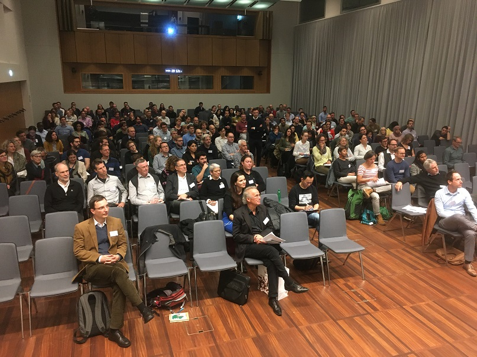
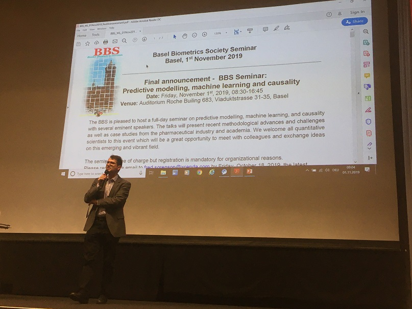
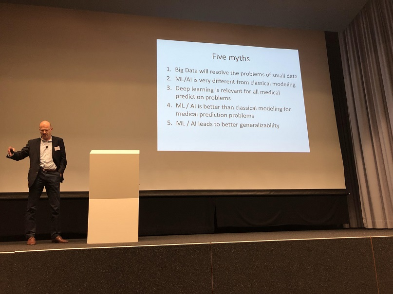
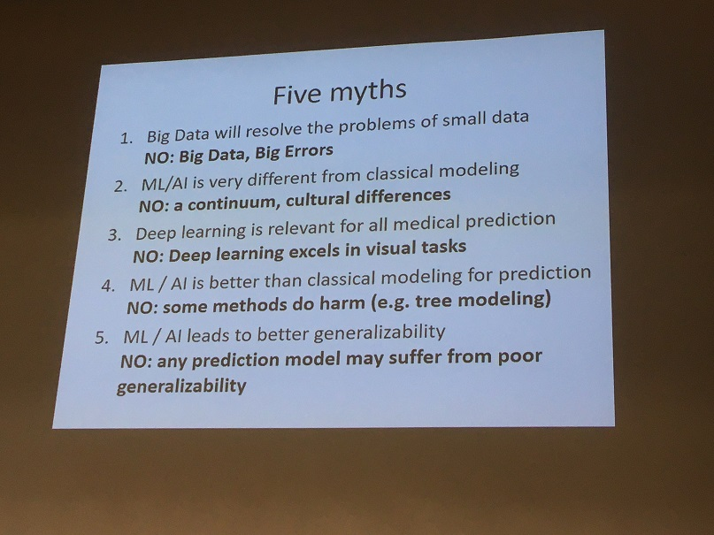
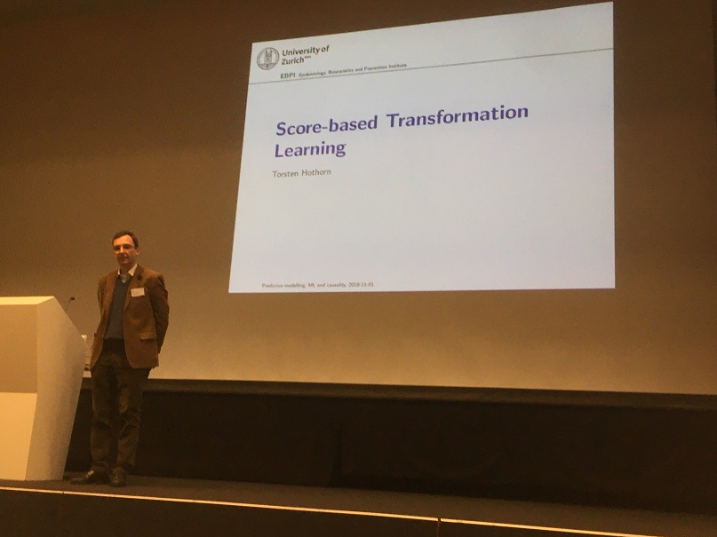
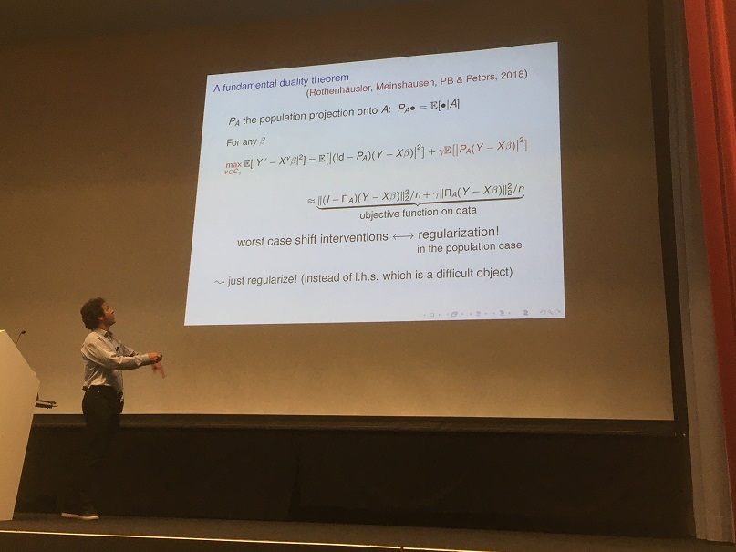
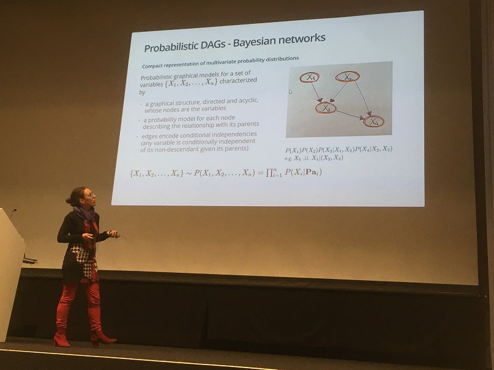
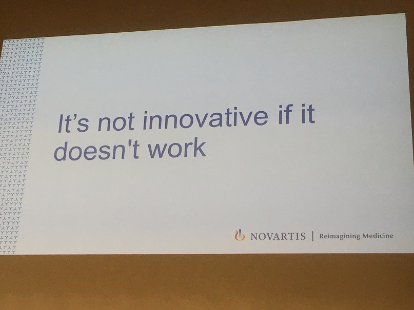
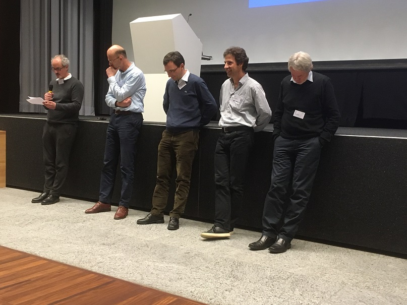
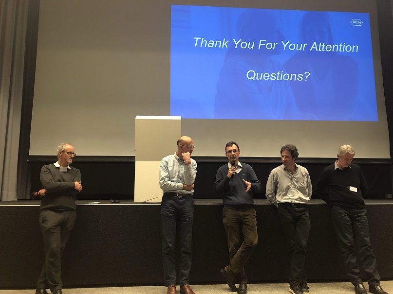

```{r setup, include=FALSE}
## load packages
packs.html <- c("knitr", "pander", "reporttools", "dplyr", "readxl")
for (k in 1:length(packs.html)){library(packs.html[k], character.only = TRUE)}

knitr::opts_chunk$set(echo = TRUE)

path <- paste(getwd(), "/talks/20191101/", sep = "")

## =================================================================
## input uebu data
## =================================================================
suppressWarnings(reg <- as.data.frame(read_excel(paste(path, "registrations.xls", sep = ""), 
                     col_types = rep("text", 2))))
inst <- select(reg, Institution)
sec  <- select(reg, Sector)
```

# Introduction

On 1st November 2019, the BBS organized a seminar on _Predictive modelling, machine learning, and causality_ with several eminent speakers. The full program including abstracts of all talks is available [here](https://baselbiometrics.github.io/home/docs/events_past.html#01112019:_BBS_Seminar:_Predictive_modelling,_machine_learning_and_causality).

# Summary

In total, `r nrow(inst)` people registered for the event and both pharma and academia were well represented amongst speakers and participants. 

The introductory talk was by [Ewout Steyerberg](https://www.universiteitleiden.nl/en/staffmembers/ewout-steyerberg) on 
["Clinical prediction models in the age of artificial intelligence and big data"](talks/20191101/1_Steyerberg.pdf). 
Ewout set the scene by dispelling five myths around big data and ML/AI:

1. Big Data will resolve the problems of small data $\Rightarrow$ _NO: Big Data, Big Errors_
2. ML/AI is very different from classical modeling $\Rightarrow$ _NO: a continuum, cultural differences_
3. Deep learning is relevant for all medical prediction $\Rightarrow$ _NO:Deep learning excels in visual tasks_
4. ML/AI is better than classical modeling for prediction $\Rightarrow$ _NO: some methods do harm (e.g. tree modeling)_
5. ML/AI leads to better generalizability $\Rightarrow$ _NO: any prediction model may suffer from poor generalizability_

[Willi Sauerbrei](https://www.imbi.uni-freiburg.de/persons-de/wfs-de/person_view_de) gave a thorough [talk on guidelines](talks/20191101/2_Sauerbrei.pdf). 
He highlighted the importance of the reporting guidelines from the [Equator network](http://www.equator-network.org/) for all types of studies including RCTs (CONSORT and extensions) or diagnostic/prognostic studies (STARD and TRIPOD). 
Willi also mentioned many other important initiatives including the [STRATOS initiative](http://www.stratos-initiative.org/) which aims to o provide accessible and accurate guidance in the design and analysis of observational studies.

[Torsten Hothorn](http://user.math.uzh.ch/hothorn/) gave a presentation on ["Score-based Transformation Learning"](talks/20191101/3_Hothorn.pdf). 
He showed that boosting, trees, and forests can be understood as algorithms leveraging the information contained in residuals
or scores for increasing model complexity. The starting point is any _appropriate_ model (and corresponding log-likelihoods and scores) featuring _interpretable parameters_. In particular, transformation models (which include most conventional regression models including Cox regression) are a convenient starting point. Torsten also provided references to his R packages to implement these methods and demonstrated boosting with nice web-apps (click on the models on Slide 35 of [his presentation](talks/20191101/3_Hothorn.pdf) to see them).

[Peter Bühlmann](https://stat.ethz.ch/~buhlmann/) presented on ["Causal Regularization for Distributional Robustness and Replicability"](talks/20191101/4_Buehlmann.pdf). He discussed the problem of using data from several heterogeneous populations to make predictions for a new population with a different data-generating mechanism. The proposed approach to achieve replicability in such settings builds on distributional robustness and borrows ideas from causality. On the spectrum from marginal correlation - regression - invariance - causality, the proposed method of anchor regression is "one step closer" to true causality than conventional regression. 

Several case studies were presented: [Giusi Moffa](https://dmi.unibas.ch/de/forschung/mathematik/statistical-science/) gave an [introduction to directed acyclic graphs](talks/20191101/5_Moffa.pdf) (DAGs) with an application in psychiatry. Andrew Shattock showed how mathematical models can be used to assess the potential impact of interventions to achieve health goals in malaria and used a Gaussian process emulator with adaptive sampling to explore the large paramater space (his slides cannot be shared publicly). Federico Mattiello presented on [prognostic models which aim to identify high-risk patients in follicular lymphoma](talks/20191101/7_Mattiello.pdf).

The two last talks provided longer case studies from Pharma. Mark Baillie gave a talk on the [Novartis benchmarking initiative to systematically evaluate vendors of AI/ML solutions](talks/20191101/8_Baillie.pdf). Interestingly, Mark proposed to assess the quality of reporting by the vendors' adherence to reporting guidelines such as TRIPOD which nicely aligned with the earlier talk by Willi Sauerbrei. Chris Harbron gave the final talk on experiences from running [internal prediction challenges within a pharmaceutical company](talks/20191101/9_Harbron.pdf) (Roche). He highlighted the many benefits that such initiatives have including promoting advanced analytics across the company and promoting cross disciplinary and cross organisation interactions (a recent challenge had 517  participants which formed 141 teams across 38 Roche sites). He also explored the role of consensus scoring to improve individual predictions models.

The succesful event ended with a panel discussion and the annual general assembly of the BBS.

# Slide decks for download

* [Steyerberg](talks/20191101/1_Steyerberg.pdf)
* [Sauerbrei](talks/20191101/2_Sauerbrei.pdf)
* [Hothorn](talks/20191101/3_Hothorn.pdf)
* [Bühlmann](talks/20191101/4_Buehlmann.pdf)
* Moffa [pdf slides](talks/20191101/5_Moffa.pdf) / [github slides](https://annlia.github.io/jPublica/BBS_201911/psychoDAGs201911.html)
* Shattock (slides cannot be shared publicly)
* [Mattiello](talks/20191101/7_Mattiello.pdf)
* [Baillie](talks/20191101/8_Baillie.pdf)
* [Harbron](talks/20191101/9_Harbron.pdf)

* [all decks as zip file](talks/20191101/20191101 BBS all slide decks.zip)

# Registrations

In total, `r nrow(inst)` people registered for the event. The distribution on institution and sectors is available below.

## By institution

```{r, echo = FALSE, fig.cap = "", fig.align = "center", fig.width = 7, fig.height = 7}
c1 <- table(inst)
c1 <- c1[rev(order(c1))]
cut <- 1
less1 <- names(c1)[c1 <= cut]
c1 <- c1[c1 > cut]
c1 <- c(c1, length(less1))
names(c1)[length(c1)] <- paste("frequency of at most ", cut, sep = "")

par(las = 2, mar = c(13, 5, 5, 1), mfrow = c(1, 1))
barplot(c1, ylim = c(0, 75), main = "BBS seminar 1st November 2019: registrations", ylab = "number of participants")
```

Institutions with a frequency of at most `r cut`: 
```{r, echo = FALSE, results = 'asis', message = FALSE}
cat(paste(less1, collapse = " / "))
```

## By sector (manually categorized)

```{r, echo = FALSE, fig.cap = "", fig.align = "center", fig.width = 7, fig.height = 7}
c1 <- table(sec)
par(las = 2, mar = c(10, 5, 5, 1), mfrow = c(1, 1))
barplot(c1[rev(order(c1))], ylim = c(0, 150), main = "BBS seminar 1st November 2019: registrations by sector", ylab = "number of participants")
```

# Pictures

```{r pic0, echo=FALSE, fig.cap="Auditorium", out.width = '50%'}

```

```{r pic1, echo=FALSE, fig.cap="Hans Ulrich Burger (BBS president)", out.width = '50%'}

```

```{r pic2, echo=FALSE, fig.cap="[Ewout Steyerberg](https://www.universiteitleiden.nl/en/staffmembers/ewout-steyerberg)", out.width = '50%'}

```

```{r pic3, echo=FALSE, fig.cap="Five myths, by Ewout Steyerberg", out.width = '50%'}

```

```{r pic4, echo=FALSE, fig.cap = "[Torsten Hothorn](http://user.math.uzh.ch/hothorn/)", out.width = '50%'}

```

```{r pic5, echo=FALSE, fig.cap="[Peter Buehlmann](https://stat.ethz.ch/~buhlmann)", out.width = '50%'}

```

```{r pic6, echo=FALSE, fig.cap="[Giusi Moffa](https://dmi.unibas.ch/de/forschung/mathematik/statistical-science/)", out.width = '50%'}

```

```{r pic7, echo=FALSE, fig.cap="Slide from talk by Mark Baillie", out.width = '50%'}

```

```{r pic8, echo=FALSE, fig.cap="Panel discussion", out.width = '50%'}

```

```{r pic9, echo=FALSE, fig.cap="Panel discussion", out.width = '50%'}

```

# Feedback and contact

We are more than happy to receive your feedback! Please feel free to reach out to any or all of the organizers by sending an email to firstname.lastname@roche.com.