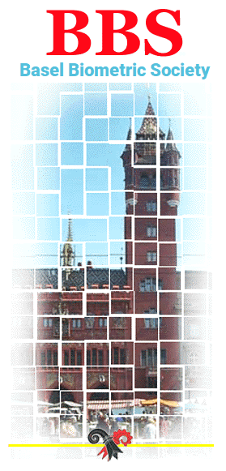

# President

Hans Ulrich Burger, F. Hoffmann-La Roche, Basel.

[Contact](mailto:info@bbsbasel.ch)

# E-mail announcements of events

If you would like to receive e-mail announcements of upcoming events please send an email to [Bibiana Blatna](mailto:bibiana.blatna@novartis.com).

# News on this site

* 2022/03/15: Added announcement of [seminar on "Graphical approaches to multiple test problems"](events_upcoming.html).
* 2022/03/15: Added recording, slidedeck, exercises (incl. dataset) of [machine learning training](https://baselbiometrics.github.io/home/docs/events_past.html#21022022:_Machine_Learning_in_clinical_drug_development).
* 2022/02/28: Added new version of [statutes](data/BBS_Statutes.pdf) with minor updates.

